<!-- ════════════════════════════════════════════════════════════════
     Dhulfiqar Ali · GitHub profile README
     Animated header / divider / footer live in /assets (SVG, self-animating).
     GitHub strips <style>/JS from Markdown, so all motion is sealed inside
     the SVG files and via SVG-rendering services — nothing here is broken.
══════════════════════════════════════════════════════════════════ -->

<div align="center">

  <a href="https://github.com/dhulnab">
    
  </a>

  <br/>

  

  <br/><br/>

  <a href="https://www.linkedin.com/in/d18b/"></a>
  <a href="mailto:dhulfiqarali6@gmail.com"></a>
  
  

</div>

<div align="center"></div>

### 🛰️ &nbsp; About me

```yaml
name:        Dhulfiqar Ali
role:        Software Engineer
company:     First Finance Company (FFC)
focus:       backend architecture · APIs · system design · AI
education:   B.Sc. Computer Engineering — Al-Nahrain University
languages:   Arabic (native) · English (professional)
mindset:     clean code, real metrics, ship to production
```

I'm a backend-focused engineer who builds **scalable, production financial systems**. At FFC I own the backend for our core **loan-engine**, the **FFC App**, and the **FFC Portal** — from system design through to production deployment. I care about performance, clean engineering standards, and turning messy business workflows into reliable automated services.

<div align="center"></div>

### 🚀 &nbsp; What I'm orbiting right now

- 🏦 &nbsp; Architecting and operating backend services for live financial products
- ⚡ &nbsp; Cutting API latency through async processing, caching, and PostgreSQL query tuning
- 🐳 &nbsp; Owning the Dockerized **CI/CD** pipeline and production releases
- 🤖 &nbsp; Automating manual business workflows into maintainable services
- 📐 &nbsp; Setting team coding standards and acting as the final code-review gate

<div align="center"></div>

### 🛠️ &nbsp; Tech stack

<div align="center">

**Languages**


**Backend &amp; frameworks**


**Data &amp; infrastructure**


**DevOps &amp; cloud**


</div>

<div align="center"></div>

### 📊 &nbsp; GitHub constellation

<div align="center">

  
  

  <br/>

  

  <br/>

  

  <br/><br/>

  

</div>

<br/>

<div align="center">
  
</div>

<div align="center">

💬 &nbsp; Open to backend &amp; full-stack engineering conversations —
reach out on **[LinkedIn](https://www.linkedin.com/in/d18b/)** or **[email](mailto:dhulfiqarali6@gmail.com)**.

</div>
